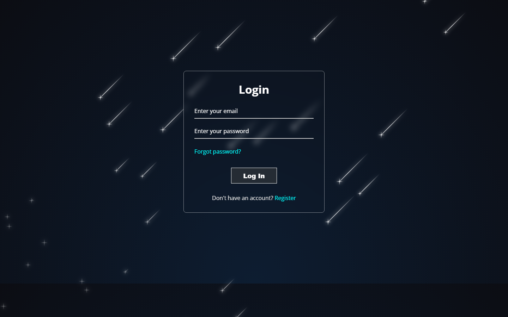
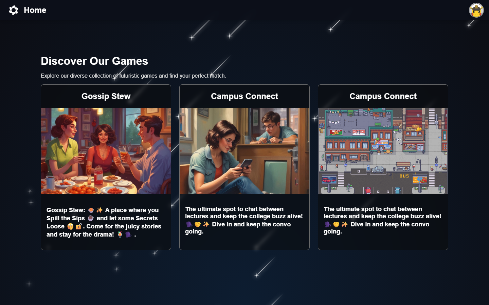
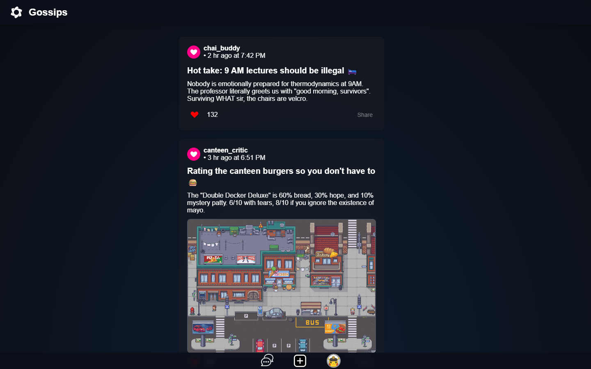
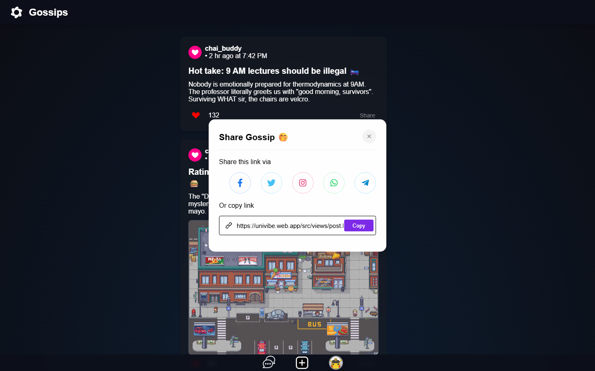
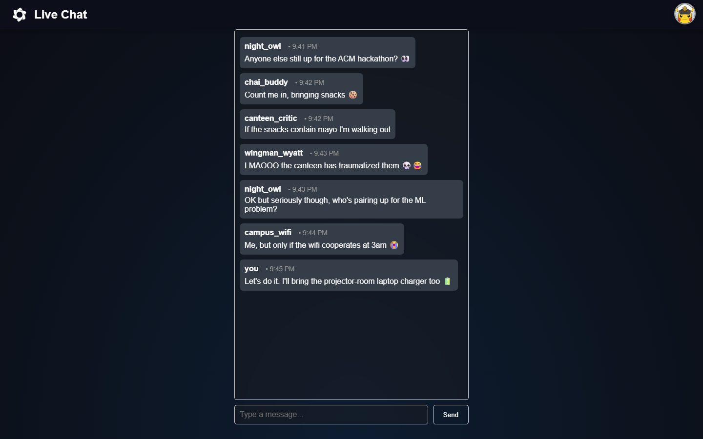
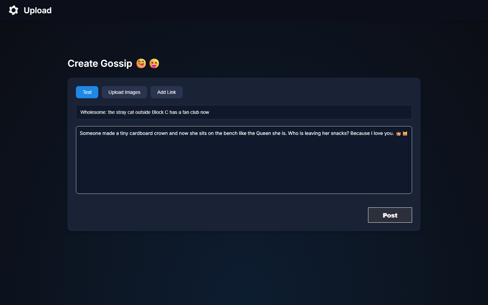
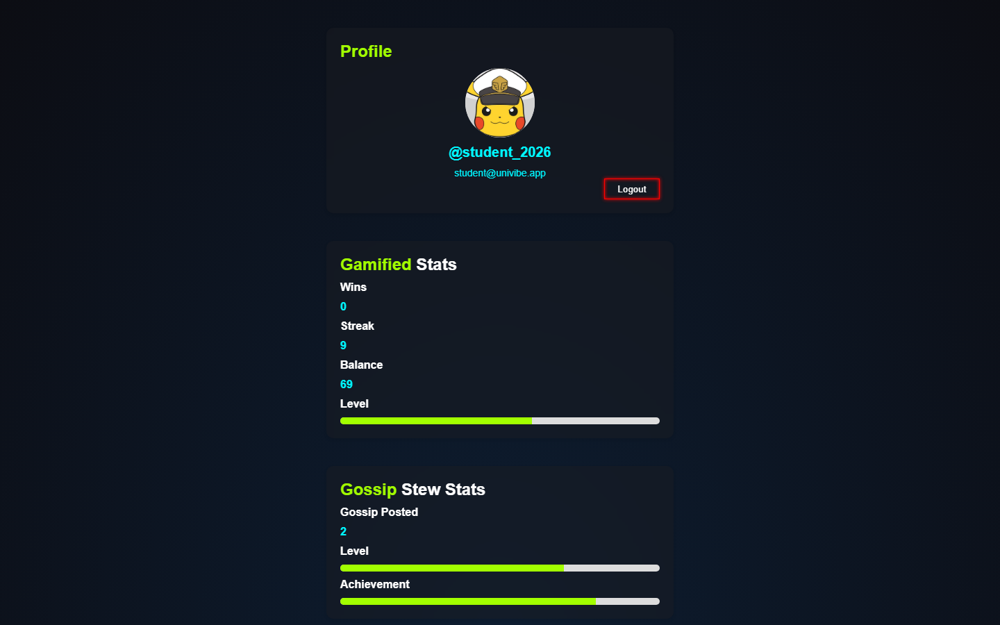

# 🎓 UniVibe — College Social & Gossip Platform

A mobile-first social app for college campuses. Students post **fun/relatable campus gossips** (rich text + up to 2 images), like and share them to WhatsApp/Telegram/X, and chat in a **real-time "Campus Connect" room**. Built as a lightweight vanilla-JS SPA on **Supabase (PostgreSQL)** and shipped with **Firebase Hosting + GitHub Actions CI/CD**.


---

## Screenshots

| Login | Home | Gossip feed |
| :---: | :---: | :---: |
|  |  |  |

| Share popup | Live chat | Create post | Profile |
| :---: | :---: | :---: | :---: |
|  |  |  |  |

> Feed / Chat / Create / Profile are rendered from `public/demo/*-preview.html` — the exact production CSS + markup, seeded with the demo data in `db/seed.sql`, so they represent the app pixel-for-pixel without needing a live DB.

---

## ✨ Features

| Area | What it does |
| --- | --- |
| **Auth** | Email/password signup, login, forgot-password, persistent sessions (Supabase GoTrue) |
| **Gossip feed** | Infinite-scroll feed (`LIMIT/OFFSET` = 20 per page), rich-text posts, image slideshow (2 images max) |
| **Likes** | One-click toggle; per-user liked state restored from the API |
| **Sharing** | WhatsApp / Telegram / X / Facebook / Instagram share links + copy-link to a deep-linked post view |
| **Live chat** | Campus Connect room streamed over **Supabase Realtime** (`postgres_changes` INSERT) |
| **Profile** | Username/email card, gamified stats, "my posts" manager with server-verified delete |
| **UI/UX** | Mobile-first, glassmorphism + animated particle/starry background, no UI library |

---

## 🧱 Tech Stack

| Layer | Technology | Role |
| --- | --- | --- |
| Frontend | Vanilla **JavaScript (ES Modules)**, HTML, CSS | SPA — zero build step, no framework |
| Backend / BaaS | **Supabase (PostgreSQL)** | Auth, database, REST (PostgREST), RLS, Realtime |
| Storage | Supabase Storage (public `gossip` bucket) | Post images |
| Hosting / CDN | **Firebase Hosting** | Static deploy, global CDN, custom domain |
| CI/CD | **GitHub Actions** | Auto-deploy live on merge + PR preview channels |
| Visual FX | Canvas (`particleground`) + CSS keyframes | Animated space/neon theme |

---

## ⚙️ Architecture

```
                    ┌───────────────────────────────────────────────┐
  Browser (SPA)     │                Supabase Backend               │
 ┌───────────────┐  │  ┌──────────────┐  ┌───────────────────────┐  │
 │ public/       │  │  │  PostgREST   │  │ PostgreSQL             │  │
 │  src/views/*  │──┼─▶│  (REST RPC)  │──▶│ · profiles (username)  │  │
 │  src/js/*     │  │  │              │  │ · gossipbar (posts)     │  │
 │  src/css/*    │  │  │  Auth (JWT)  │  │ · likes                 │  │
 └───────┬───────┘  │  └──────────────┘  │ · messages (live chat)  │  │
         │          │  Realtime channel  │  RLS enabled on all     │  │
         └────────────── (INSERT msgs)   │─────────────────────────│  │
                    │  Storage "gossip"  │──── post images         │  │
                    └───────────────────────────────────────────────┘
                         ▲
         Firebase Hosting (static files) + GitHub Actions CI/CD
```

**The frontend never touches tables directly.** Every read/write goes through a **SECURITY DEFINER stored function** — that server-side function layer *is* the backend API. Because Supabase handles Auth, Postgres, REST and Realtime, the whole system is four tables plus eleven stored functions (below).

> Interview note: the repo's `firebase.json` / `.firebaserc` are **only** static hosting + CI deploy. The application backend is Supabase/Postgres — a clean separation of "app backend" vs "hosting" you can walk through step by step.

---

## 🗄️ Backend — Database Schema

All tables sit behind **Row Level Security** (see `db/schema.sql`):

| Table | Purpose | Key columns |
| --- | --- | --- |
| `profiles` | User profile (1:1 with `auth.users`) | `id` PK, `username` unique, 3–20 chars |
| `gossipbar` | Posts | `id`, `user_id`, `username` (denormalised), `title` (≤300), `content` (HTML), `images text[2]`, `likes`, `created_at` |
| `likes` | Like rows | PK(`user_id`, `post_id`), `created_at` |
| `messages` | Live chat | `id`, `user_id`, `username`, `message`, `created_at` |

**Reference SQL:** [`db/schema.sql`](db/schema.sql) · **Demo data:** [`db/seed.sql`](db/seed.sql)

## 🔌 Backend API — Stored Functions (RPC)

| Function (called by the frontend) | Purpose |
| --- | --- |
| `checkUsername(p_username)` | `TRUE` if username already taken (signup validation) |
| `insertUsername(p_id, p_username)` | Create the user's `profiles` row at signup |
| `get_username(p_user_id)` | Fetch username after login (SPA caches it in `localStorage`) |
| `insert_into_gossipbar(p_uuid, p_title, p_content, p_images)` | Create a post; username resolved server-side; images arrive as `{0,1}` |
| `fetch_posts(user_uuid, limit, offset)` | Paginated feed, each post tagged with the viewer's `isliked` |
| `fetch_shared_posts(user_uuid, post_id)` | Load one post by id (deep-linked share view) |
| `fetch_my_posts(user_uuid, limit, offset)` | Current user's posts only (profile screen) |
| `toggle_like(p_userid, p_postid)` | Toggle like + keep count consistent atomically; returns `TRUE` = liked |
| `delete_gossipbar_post(p_userid, p_postid)` | Delete **only if** `gossipbar.user_id = p_userid` (no IDOR) |
| `insert_message(user_id, message)` | Insert chat message, then broadcast via Realtime |
| `fetch_live()` | Seed the last 30 messages when the chat room opens |

**Key design decisions (good for interviews):**

- **RLS + SECURITY DEFINER** — the browser can't `.select()`/`.insert()` on tables; it can only invoke these functions. The response is exactly what the UI needs (no over-fetching).
- **Likes are normalized** — the `likes` table (PK per user+post) is the source of truth; `gossipbar.likes` is updated in the same function so the feed never needs a per-row `COUNT()`.
- **Realtime chat** — the client subscribes to `postgres_changes` INSERTs on `messages` via a channel; new messages appear instantly, zero polling. `fetch_live()` hydrates history on load.
- **Image upload** — files go to the `gossip` bucket; the post stores up to 2 filenames (`text[2]`); the public URL is assembled on read.

---

## 📂 Project Structure

```
├── public/                      # 💻 statically-served web app
│   ├── index.html               # redirect → views/login.html
│   └── src/
│       ├── views/               # pages: login, homepage, gossip, post, livechat, profile, upload
│       ├── js/                  # per-page logic (ES modules = "controllers")
│       ├── css/                 # neon/particle space theme
│       ├── utils/               # supabase client init, auth guard, session helpers
│       └── assets/              # logo + images
├── public/demo/                 # offline preview pages (same CSS/markup as prod)
├── db/
│   ├── schema.sql               # 🗄️ THE backend: tables, RLS, RPCs, storage, realtime
│   └── seed.sql                 # demo gossips + chat messages
├── scripts/seed-demo-data.js    # Node seeder (PostgREST, service_role key)
├── .github/workflows/           # Firebase hosting CI/CD (merge + PR preview)
└── firebase.json · .firebaserc  # hosting config + project mapping
```

---

## 🚀 Getting Started

### 1. Run the frontend locally
```bash
git clone <your-repo-url>
cd univibe
npm ci                     # pulls lockfile for CI (no deps needed for the SPA)
npm run serve              # Serves public/ → http://127.0.0.1:5401
# or open public/ with VS Code "Live Server" (port 5501)
```
Open `http://127.0.0.1:5401/src/views/login.html`.

### 2. Backend (Supabase) setup
1. Create a free project at [supabase.com](https://supabase.com).
2. In **SQL Editor**, run `db/schema.sql` — creates the 4 tables, **RLS**, all 11 RPC functions, the `gossip` storage bucket + policies, and the Realtime publication on `messages`.
3. Run `db/seed.sql` to load demo gossips + chat messages.
4. Add your Supabase credentials locally — they are **never committed to git**:
   - Copy `public/src/utils/config.example.js` → `public/src/utils/config.js`
   - Fill in your project's URL and anon key (`config.js` is in `.gitignore`)
5. Enable **Email** auth provider and user sign-ups. Sign up → pick a username → done.

> Alternatively seed from Node (uses a `service_role` key, writes tables directly):
> ```bash
> $env:SUPABASE_URL="https://YOUR-REF.supabase.co"
> $env:SUPABASE_SERVICE_ROLE_KEY="<service_role key>"
> node scripts/seed-demo-data.js
> ```

### 3. Deploy (Firebase Hosting + GitHub Actions)
```bash
npm i -g firebase-tools
firebase login
firebase use <your-firebase-project>   # also update .firebaserc
firebase deploy --only hosting
```
- Push to `main` → `.github/workflows/firebase-hosting-merge.yml` deploys `public/` to `https://univibe.web.app`.
- Open a PR → the PR workflow creates an isolated **preview channel** URL automatically.

---

## 🔐 Security Model (how the backend stays safe)

| Threat | Mitigation |
| --- | --- |
| Reading/editing other users' data | **RLS on every table** + browser only ever calls the stored-function API |
| Deleting someone else's post (IDOR) | `delete_gossipbar_post` enforces `user_id = auth.uid()` server-side |
| Exposed `anon` key | Safe by design — the anon key can only invoke the fixed RPC surface; `service_role` is used only by dev seeding |
| Garbage/oversized input | CHECK constraints (`title ≤ 300`, username 3–20) + server-side validation |
| Session security | JWT sessions from Supabase GoTrue; `checkAuth.js` guards every protected page per load |

---

## 🗺️ Roadmap (natural next features)

- Comment threads under posts · user reports/moderation queue (RLS-protected)
- Realtime **presence** ("typing…", online count) over Supabase channels
- Automated tests via `node:test` against the Supabase CLI **local emulator** + Prettier lint gate in CI
- Optional **app/web-server edge function** so the anon key never sits in the bundle (defense in depth)

---

## 📄 License

Educational demonstration. Demo posts/screenshots are placeholders — swap in your real campus content for a polished launch.

---
_Built for the campus scramble: vanilla JS, SQL, and way too many 9 AM lectures._ ☕
